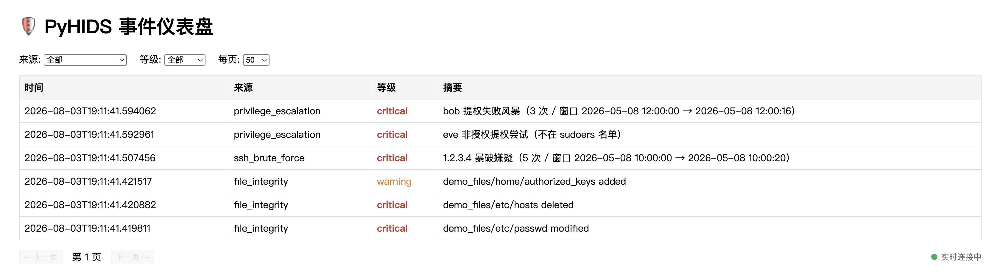

# PyHIDS

用 Python 写的轻量级主机入侵检测系统（HIDS）。

盯着几个关键文件有没有被偷偷改动、有没有人在暴力破解 SSH、有没有人在乱试 sudo 提权 ——
发现了就记下来、发条告警，并且能在网页上看到。



---

## 为什么写这个

我是个大三学生。上系统安全课的时候第一次听说 OSSEC、Wazuh 这类主机入侵检测系统，
老师讲的原理听起来不难 —— 无非是"记下文件的哈希，过一会儿再算一次，对不上就是被改了"。
但我总觉得哪里没想明白：**真做起来，那些"不难"的地方到底难在哪？**

于是决定自己写一个。写完发现，难的果然不是哈希算法：

- 编辑器保存一次文件，操作系统会甩给你 3~5 个事件，怎么不让它触发 5 次告警？
- 同一个攻击持续一小时，怎么不让告警群被刷爆，又不至于漏掉新的攻击？
- 检测程序自己被攻破了怎么办？

这些书上不会讲，但全是真问题。这个项目就是我把它们一个个想明白的过程。

代码全部自己写，功能按里程碑一个个加（`git log` 里能看到 M1 到 M6 的推进过程）。
现在 1700 行源码 + 1100 行测试，89 个单元测试。

---

## 能做什么

| | |
|---|---|
| 📁 **文件完整性监控** | SHA-256 基线比对，找出被修改 / 删除 / 新增的文件 |
| ⚡ **实时监控** | 常驻进程，文件一被改动几秒内就发现，不用等定时任务 |
| 🔑 **SSH 暴破检测** | 解析 auth.log，揪出短时间内反复登录失败的 IP |
| 🛡️ **提权滥用检测** | sudo/su 认证失败风暴，以及不在 sudoers 名单却尝试提权的人 |
| 💾 **事件持久化** | SQLite 单文件数据库，随时回查历史 |
| 📢 **告警** | 钉钉机器人 + 邮件，带时间窗去重，不刷屏 |
| 📊 **Web 仪表盘** | 实时推送、按来源/等级过滤、翻页看历史 |
| 📦 **三种用法** | 命令行 / Docker / 双击即用的桌面 App |

---

## 快速开始

### 最简单：双击运行

```bash
pip install -e ".[dev]"
pyinstaller pyhids.spec --noconfirm    # 产物在 dist/PyHIDS.app
open dist/PyHIDS.app
```

双击之后它会自己建立基线、开始实时监控、打开浏览器显示仪表盘。
拷给别人也能直接用 —— **对方不需要装 Python**。

### 命令行

```bash
python3 -m venv .venv && source .venv/bin/activate
pip install -e ".[dev]"

pyhids baseline      # 先给被监控的文件拍个"指纹快照"
pyhids check         # 之后随时对比，看有没有被动过
pyhids ssh-check     # 查 SSH 暴破
pyhids sudo-check    # 查提权滥用
pyhids events        # 翻历史事件
pyhids watch         # 实时监控（常驻，Ctrl+C 退出）
pyhids serve         # 打开仪表盘
```

`check` / `ssh-check` / `sudo-check` 发现问题时**退出码是 1**，所以可以直接接到 shell 里：

```bash
pyhids check || echo "出事了！"
```

### Docker

```bash
docker compose up -d --build
```

---

## 三个检测源

| 命令 | 看什么 | 什么情况算异常 |
|---|---|---|
| `pyhids check` | 文件的 SHA-256 | 和基线对不上 |
| `pyhids ssh-check` | auth.log 里的 SSH 登录失败 | 同一 IP 在 60 秒内失败 5 次 |
| `pyhids sudo-check` | auth.log 里的 sudo / su | 同一用户 60 秒内失败 3 次，**或者**出现 `user NOT in sudoers` |

`sudo-check` 这里我特意做了区分：失败风暴要达到阈值才报，但 **`user NOT in sudoers` 出现一次就报**。
理由是这两件事的性质不一样 —— 有权限的人输错密码很正常，但一个**根本没有 sudo 权限**的账号在尝试提权，
这本身就已经很不对劲了。相对地，单次 `su` 失败我不报，那多半只是手滑打错密码。

三个检测源共用同一张 `events` 表（单表 + JSON payload）。加第三个检测源的时候我特地留意了一下：
**数据库结构一个字都没改**，只写了个新的工厂函数。这个设计算是赌对了。

---

## 实时监控

`pyhids check` 是跑一次就结束的，适合挂 cron。`pyhids watch` 是常驻进程：

```bash
pyhids watch                       # Ctrl+C 退出
pyhids watch --quiet-period 2.0    # 改动安静 2 秒后才检查
```

这里有个我一开始没想到的坑：**在编辑器里保存一次文件，watchdog 会报出 3~5 个事件**
（写临时文件 → 重命名 → 改元数据……）。如果每个事件都触发一次检查，那保存一次文件，
钉钉群里就炸 5 条消息。更糟的是如果在第一个事件就立刻算哈希，很可能读到**写了一半的文件**，
结果是一个中间态的垃圾值，报出来还是误报。

解决办法叫**去抖动**：事件来了先不动，等到"安静"满 1 秒（`--quiet-period`）才认为这波改动结束，
这时候再检查。实现时我把"当前时间"做成参数传进去而不是在函数里调 `time.monotonic()` ——
这样写测试时不用真的 `sleep` 一秒，直接喂假的时间戳就行。整套时序逻辑的 8 个测试跑完只要几毫秒。

---

## 仪表盘

```bash
pyhids serve                  # http://127.0.0.1:8000
```

可以按来源和等级过滤、翻页看历史，新事件会自己冒出来。

最早我用的是前端每 5 秒 fetch 一次的笨办法。后来换成了 **SSE（服务端推送）**：
浏览器挂一条长连接，服务端只在**事件 id 真的变了**的时候推一次，浏览器收到再去拉数据。
这样没有新事件的时候，闲置的仪表盘一个请求都不发。

推送的内容只有一个游标数字、不含事件本身 —— 这样过滤和分页的逻辑还留在原来那个 `load()` 函数里，
不用在推送通道里再实现一遍。另外翻到第 2 页之后自动刷新会暂停，不然你正在翻历史却被拽回顶部，很烦。

> ⚠️ 仪表盘**没有任何登录认证**。默认只监听 `127.0.0.1`，请不要直接暴露到公网 ——
> 要远程看的话用 SSH 隧道，或者前面挡一层带认证的 Nginx。

---

## 配置

改 `config/watchlist.yaml`：

```yaml
paths:                              # 想盯着的文件
  - /etc/passwd
  - /etc/ssh/sshd_config
  - /root/.ssh/authorized_keys      # 攻击者留后门的首选位置

ssh:
  log_path: /var/log/auth.log
  window_seconds: 60
  threshold: 5                      # 60 秒内失败 5 次就算暴破

sudo:
  log_path: /var/log/auth.log
  threshold: 3

alert:
  dingtalk_webhook: ""              # 填上钉钉机器人地址就会推送
  dedup_window_seconds: 3600        # 同一个问题 1 小时内只告警一次
```

路径也可以用环境变量覆盖，Docker 和桌面 App 都靠这个接管数据位置：

| 环境变量 | 默认值 |
|---|---|
| `PYHIDS_DB_PATH` | `data/events.db` |
| `PYHIDS_BASELINE_PATH` | `data/baseline.json` |
| `PYHIDS_CONFIG_PATH` | `config/watchlist.yaml` |
| `PYHIDS_DATA_DIR` | App 模式的数据目录（见下） |

**桌面 App 的数据放在这些地方**（首次启动自动生成，改了不会被覆盖）：

| 平台 | 目录 |
|---|---|
| macOS | `~/Library/Application Support/PyHIDS/` |
| Linux | `~/.local/share/pyhids/` |
| Windows | `%APPDATA%\PyHIDS\` |

里面有 `watchlist.yaml`、`events.db`、`baseline.json` 和 `pyhids.log`。
双击启动是没有终端窗口的，所以**出问题先看 `pyhids.log`**，那是唯一能看到报错的地方。

---

## 部署到真实服务器

**先在系统干净的时候建基线。** 这一步的时机决定了整个系统有没有意义 ——
基线就是"正常"的定义，如果在一台已经被入侵的机器上建基线，后门文件会被当成正常状态**永久放行**。

```bash
sudo pyhids baseline
```

然后挂 cron 定时跑（注意用绝对路径，cron 的 PATH 很干净）：

```bash
*/10 * * * * /opt/pyhids/.venv/bin/pyhids check      >> /var/log/pyhids.log 2>&1
*/5  * * * * /opt/pyhids/.venv/bin/pyhids ssh-check  >> /var/log/pyhids.log 2>&1
*/5  * * * * /opt/pyhids/.venv/bin/pyhids sudo-check >> /var/log/pyhids.log 2>&1
```

文件监控用 `watch` 比 cron 及时得多（秒级 vs 10 分钟），可以写个 systemd unit 让它常驻：

```ini
[Unit]
Description=PyHIDS real-time file monitor
After=network.target

[Service]
Type=simple
WorkingDirectory=/opt/pyhids
ExecStart=/opt/pyhids/.venv/bin/pyhids watch
Restart=always

[Install]
WantedBy=multi-user.target
```

**几个容易忽略的点：**

- 读 `/var/log/auth.log` 需要权限，cron 要放在 root 的 crontab 里，或者把用户加进 `adm` 组
- `baseline.json` 本身就是攻击目标 —— 攻击者装完后门只要跑一次 `pyhids baseline`，
  篡改就被"洗白"了。生产环境应该把它设成 root 只读，最好定期备份到另一台机器上比对

### Docker

```bash
docker compose up -d --build
```

容器以非特权用户 `pyhids`（UID 1000）运行，带 `HEALTHCHECK`。
在 Linux 上要让挂进去的 `data/` 对该 UID 可写：`sudo chown -R 1000:1000 data`。

**要监控的目录必须只读挂载进去。** 容器只能看见自己的文件系统，
`watchlist.yaml` 里列了却没挂进去的路径会被报成"文件已删除"，全是误报：

```yaml
volumes:
  - /etc:/host/etc:ro     # 然后 watchlist.yaml 里写 /host/etc/... 开头的路径
```

那个 `:ro`（只读）不是随手加的 —— 万一 PyHIDS 自己被攻破，攻击者也改不了它监控的文件。
**检测程序对被监控目标应该是只读的**，这算是安全工具的基本纪律。

---

## 这个项目让我学到的

比起功能本身，下面这些是我觉得更有价值的收获：

**分层要真的分。** 检测逻辑（`checker` / `ssh_check` / `sudo_check`）不允许 import 数据库层，
只暴露 `event_from_*` 工厂函数，由 CLI 负责把它们粘起来。刚开始觉得这是多此一举，
后来发现**89 个测试里绝大部分根本不需要数据库就能跑，全套跑完 0.3 秒** —— 这就是分层的直接回报。

**"当前时间"应该是参数，不是函数里现取的。** 去抖动器的所有时序逻辑都靠这个才测得动。
同理，实时监控模块通过 `on_change` 回调把"落库+告警"交给上层，自己完全不知道下游是什么。

**早期的简化会在新场景下露出代价。** 路径常量写成 `Path(os.getenv(...))` 放在模块顶层，
意味着环境变量在 **import 那一刻**就被读死了。对命令行和 Docker 完全够用；
但做桌面 App 时就不够了 —— 得先 `bootstrap()` 设好环境变量再 import，所以 App 入口里
那些 import 全部改成了延迟执行。这不是当初写错了，是需求变了之后简化方案到期了。

**验证要够"真"才算数。** 有一次我给 ssh-check 接告警，改完跑了一遍没报错就提交了，
其实压根没接上 —— 因为 webhook 是空的，跑起来什么都看不出来。
从那以后我的习惯是：**构造一个"如果坏了一定会暴露"的场景再验证**。
比如测实时监控，我不是看它启动成功就完事，而是真的去改一个被监控的文件，
再去数据库里确认那条事件躺在里面。

（更多踩坑记录在 [HANDOFF.md](HANDOFF.md) 第 8 节，30 多条，全是真实翻车现场。）

---

## 已知限制

老实说清楚：

- **日志解析依赖文本格式的 auth.log**。Debian/Ubuntu 可以直接用；RHEL/CentOS 改成 `/var/log/secure`；
  但纯 systemd-journald 的系统（没有文本日志文件）目前读不了，得改成解析 `journalctl` 输出。
- **macOS 上只有文件监控能用**。macOS 没有 `/var/log/auth.log`，所以 SSH 和提权检测在本机跑不了
  （仪表盘和文件监控不受影响）。
- **仪表盘没有认证**，见上文警告。
- **桌面 App 没有代码签名**。自己机器上跑没问题，但拷给别人时 macOS 会拦一下，
  对方需要右键 →「打开」。彻底解决要 Apple 开发者账号。
- **同一个问题每次检测都会新增一行**，所以仪表盘上会看到重复行。
  告警层已经去重了，但存储层没有 —— 想改的话要考虑丢掉"上次见到是什么时候"这个信息。

---

## 项目状态

v1.2.0，roadmap 上的功能都做完了。89 个测试全绿。

需要 **Python 3.10+**（用了 `X | None`、`list[X]` 这些新语法）。

如果你也在学这块，欢迎提 issue 交流 —— 尤其是如果你发现了我没想到的坑。

---
---

# English

# PyHIDS

A lightweight host-based intrusion detection system written in Python.

It watches a handful of critical files for tampering, spots SSH brute-force
attempts, catches sudo/su privilege abuse — then records it, alerts you, and
shows it all on a web dashboard.


## Why I built it

I'm a third-year CS student. I first heard about OSSEC and Wazuh in a systems
security class, and the idea sounded simple enough — hash the files, hash them
again later, and if they differ, something changed it. But I kept feeling like I
was missing something: **when you actually build it, where does the difficulty
hide?**

So I wrote one. Turns out the hashing was never the hard part:

- One editor save fires 3–5 filesystem events. How do you not send 5 alerts?
- An attack lasting an hour — how do you avoid flooding the chat without missing
  anything new?
- What if the detector itself gets compromised?

None of that was in the lecture notes, but all of it is real. This project is me
working through those questions one at a time.

Everything is hand-written, built milestone by milestone (you can follow M1
through M6 in `git log`). It sits at ~1,700 lines of source and ~1,100 lines of
tests, with 89 unit tests.

## What it does

| | |
|---|---|
| 📁 **File integrity** | SHA-256 baseline diffing — modified / deleted / added |
| ⚡ **Real-time watching** | A resident process that reacts in seconds, no cron delay |
| 🔑 **SSH brute force** | Parses auth.log for repeated failures from one IP |
| 🛡️ **Privilege abuse** | sudo/su failure bursts, and users not in sudoers |
| 💾 **Event storage** | Single-file SQLite, queryable any time |
| 📢 **Alerting** | DingTalk + email, with time-windowed dedup |
| 📊 **Dashboard** | SSE push, source/severity filters, pagination |
| 📦 **Three ways to run** | CLI, Docker, or a double-clickable desktop app |

## Quick start

**Easiest — double-click it:**

```bash
pip install -e ".[dev]"
pyinstaller pyhids.spec --noconfirm    # -> dist/PyHIDS.app
open dist/PyHIDS.app
```

It builds a baseline, starts watching, and opens the dashboard on its own. Hand
the bundle to anyone — **they don't need Python installed**.

**Command line:**

```bash
python3 -m venv .venv && source .venv/bin/activate
pip install -e ".[dev]"

pyhids baseline      # snapshot the fingerprints of the watched files
pyhids check         # compare against that snapshot
pyhids ssh-check     # SSH brute force
pyhids sudo-check    # privilege abuse
pyhids events        # browse history
pyhids watch         # real-time monitor (Ctrl+C to stop)
pyhids serve         # dashboard
```

The three check commands **exit 1** when they find something, so they compose
straight into shell:

```bash
pyhids check || echo "something happened!"
```

**Docker:**

```bash
docker compose up -d --build
```

## The three detection sources

| Command | Looks at | What counts as trouble |
|---|---|---|
| `pyhids check` | file SHA-256 | differs from the baseline |
| `pyhids ssh-check` | SSH failures in auth.log | 5 failures from one IP in 60s |
| `pyhids sudo-check` | sudo / su in auth.log | 3 failures from one user in 60s, **or** any `user NOT in sudoers` |

`sudo-check` treats those two cases differently on purpose. A burst has to reach
the threshold, but a single `user NOT in sudoers` line is reported immediately —
someone with legitimate access mistyping a password is normal, but an account
with **no sudo rights at all** trying to escalate is already wrong. A lone failed
`su`, on the other hand, stays quiet; that's just a typo.

All three write to the same `events` table (single table + JSON payload). When I
added the third source I paid attention: **the schema didn't change by a single
character**, only a new factory function. That design bet paid off.

## Real-time monitoring

`pyhids check` is one-shot, made for cron. `pyhids watch` stays resident:

```bash
pyhids watch
pyhids watch --quiet-period 2.0
```

Here's something I didn't see coming: **saving a file once in an editor produces
3–5 watchdog events** (temp file, rename, metadata update…). Trigger a check on
each and one save floods the chat with five alerts. Worse, hashing on the *first*
event can read a **half-written file** and report a garbage mid-write hash.

The fix is debouncing: hold events, and only run the check once things have been
quiet for `--quiet-period` seconds. I pass "now" in as a parameter rather than
calling `time.monotonic()` inside the function — so the tests feed it fake
timestamps instead of actually sleeping. All 8 timing tests finish in
milliseconds.

## Dashboard

```bash
pyhids serve                  # http://127.0.0.1:8000
```

Filter by source and severity, page through history, watch events arrive live.

It started as a dumb 5-second `fetch` loop. Now it's **SSE**: the browser holds
one connection, the server pushes only when the event-id cursor actually moves,
and the browser then re-fetches. An idle dashboard makes zero requests.

The push carries just the cursor, not the events — that way filtering and paging
stay in the existing `load()` function instead of being reimplemented inside the
stream. Auto-refresh also pauses past page 1, so browsing history doesn't yank
you back to the top.

> ⚠️ The dashboard has **no authentication**. It binds `127.0.0.1` by default —
> don't expose it publicly. Use an SSH tunnel, or put authenticating Nginx in
> front.

## Configuration

Edit `config/watchlist.yaml`:

```yaml
paths:
  - /etc/passwd
  - /etc/ssh/sshd_config
  - /root/.ssh/authorized_keys      # a favourite backdoor spot

ssh:
  log_path: /var/log/auth.log
  window_seconds: 60
  threshold: 5

sudo:
  log_path: /var/log/auth.log
  threshold: 3

alert:
  dingtalk_webhook: ""
  dedup_window_seconds: 3600        # same issue alerts at most hourly
```

Paths can be overridden by environment variables — that's how Docker and the
desktop app relocate their data:

| Variable | Default |
|---|---|
| `PYHIDS_DB_PATH` | `data/events.db` |
| `PYHIDS_BASELINE_PATH` | `data/baseline.json` |
| `PYHIDS_CONFIG_PATH` | `config/watchlist.yaml` |
| `PYHIDS_DATA_DIR` | app-mode data directory (below) |

The desktop app keeps its data here (seeded on first run, never overwritten
afterwards):

| Platform | Directory |
|---|---|
| macOS | `~/Library/Application Support/PyHIDS/` |
| Linux | `~/.local/share/pyhids/` |
| Windows | `%APPDATA%\PyHIDS\` |

A double-clicked app has no terminal, so **`pyhids.log` in there is the only
place startup errors appear** — read it first when something looks off.

## Deploying on a real server

**Build the baseline while the system is clean.** This is the step that decides
whether any of this means anything — the baseline *is* your definition of
"normal", so building it on an already-compromised host permanently whitelists
the backdoor.

```bash
sudo pyhids baseline
```

Then schedule it (absolute paths — cron's PATH is nearly empty):

```bash
*/10 * * * * /opt/pyhids/.venv/bin/pyhids check      >> /var/log/pyhids.log 2>&1
*/5  * * * * /opt/pyhids/.venv/bin/pyhids ssh-check  >> /var/log/pyhids.log 2>&1
*/5  * * * * /opt/pyhids/.venv/bin/pyhids sudo-check >> /var/log/pyhids.log 2>&1
```

For files, `watch` beats cron by a wide margin (seconds vs. 10 minutes) — run it
under systemd with `Restart=always`.

Two things people miss:

- Reading `/var/log/auth.log` needs privileges — use root's crontab, or add the
  user to the `adm` group.
- `baseline.json` is itself a target. An attacker who plants a backdoor and then
  runs `pyhids baseline` has laundered the change. Make it root-owned read-only,
  and ideally diff it against a copy on another machine.

### Docker

```bash
docker compose up -d --build
```

Runs as the unprivileged user `pyhids` (UID 1000) with a `HEALTHCHECK`. On Linux
make the mounted `data/` writable by that UID: `sudo chown -R 1000:1000 data`.

**Mount what you monitor read-only.** A container only sees its own filesystem,
so paths in `watchlist.yaml` that were never mounted get reported as *deleted* —
pure false positives:

```yaml
volumes:
  - /etc:/host/etc:ro     # then use /host/etc/... in watchlist.yaml
```

The `:ro` isn't decoration. If PyHIDS itself is compromised, the attacker still
can't touch what it watches. **A detector should have read-only access to its
targets** — basic hygiene for security tooling.

## What I learned

More valuable to me than the features:

**Layering only helps if you actually enforce it.** The detection modules aren't
allowed to import the storage layer; they expose `event_from_*` factories and the
CLI wires them together. It felt like ceremony at first — until I noticed that
**most of the 89 tests need no database at all and the whole suite runs in
0.3s**. That's the payoff.

**"Now" should be a parameter, not something a function reads for itself.** It's
the only reason the debouncer's timing logic is testable. Same idea behind the
`on_change` callback: the watcher has no idea whether the downstream writes to a
database or sends an email.

**Early simplifications come due when requirements change.** Storing path
constants as `Path(os.getenv(...))` at module level means the environment is read
**at import time**. Fine for CLI and Docker. Not fine for a desktop app, where
`bootstrap()` has to set those variables first — so every such import in the app
entry point became deferred. That wasn't a mistake originally; the simplification
just expired.

**Verification only counts if it could actually fail.** I once wired alerting
into ssh-check, ran it, saw no errors, and committed — it wasn't wired up at all.
The webhook was empty, so nothing could possibly have shown up. Since then my
habit is to **construct a scenario that would definitely break if the code were
wrong**. Testing the real-time monitor, I didn't stop at "it started" — I
tampered with a watched file and then confirmed the row was sitting in the
database.

(30-odd more, all real, in section 8 of [HANDOFF.md](HANDOFF.md).)

## Known limitations

Stated plainly:

- **Log parsing assumes a text-format auth.log.** Fine on Debian/Ubuntu; use
  `/var/log/secure` on RHEL/CentOS. Systems with only systemd-journald aren't
  supported yet — that needs a `journalctl` parser.
- **On macOS only file monitoring works.** There's no `/var/log/auth.log`, so the
  SSH and privilege checks can't run locally (the dashboard and file watching are
  unaffected).
- **No dashboard authentication**, see the warning above.
- **The desktop app isn't code-signed.** Fine on your own machine; anyone you send
  it to will need right-click → Open. Fixing it properly needs an Apple developer
  account.
- **Every check inserts a new row**, so the dashboard shows repeats. Alerting is
  deduped, storage isn't — fixing that means giving up the "when was this last
  seen" information.

## Status

v1.2.0. Everything on the roadmap is done. 89 tests passing.

Requires **Python 3.10+** (uses `X | None` and `list[X]` syntax).

If you're learning this stuff too, issues welcome — especially if you spot
something I got wrong.
